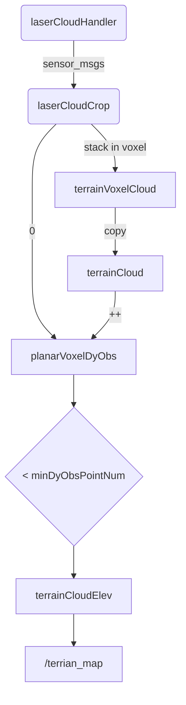

# [Terrain_Analysis](https://github.com/shu1ong/gitblog/issues/31)



```C++
#include <math.h>
#include <ros/ros.h>
#include <stdio.h>
#include <stdlib.h>
#include <time.h>

#include <message_filters/subscriber.h>
#include <message_filters/sync_policies/approximate_time.h>
#include <message_filters/synchronizer.h>

#include <nav_msgs/Odometry.h>
#include <sensor_msgs/Joy.h>
#include <sensor_msgs/PointCloud2.h>
#include <std_msgs/Float32.h>

#include <tf/transform_broadcaster.h>
#include <tf/transform_datatypes.h>

#include <pcl/filters/voxel_grid.h>
#include <pcl/kdtree/kdtree_flann.h>
#include <pcl/point_cloud.h>
#include <pcl/point_types.h>
#include <pcl_conversions/pcl_conversions.h>

using namespace std;

const double PI = 3.1415926;

double scanVoxelSize = 0.05;
double decayTime = 2.0;
double noDecayDis = 4.0;
double clearingDis = 8.0;
bool clearingCloud = false;
bool useSorting = true;
double quantileZ = 0.25;
bool considerDrop = false;
bool limitGroundLift = false;
double maxGroundLift = 0.15;
bool clearDyObs = false;
double minDyObsDis = 0.3;
double minDyObsAngle = 0;
double minDyObsRelZ = -0.5;
double minDyObsVFOV = -16.0;
double maxDyObsVFOV = 16.0;
int minDyObsPointNum = 1;
bool noDataObstacle = false;
int noDataBlockSkipNum = 0;
int minBlockPointNum = 10;
double vehicleHeight = 1.5;
int voxelPointUpdateThre = 100;
double voxelTimeUpdateThre = 2.0;
double minRelZ = -1.5;
double maxRelZ = 0.2;
double disRatioZ = 0.2;

// terrain voxel parameters
float terrainVoxelSize = 0.5;
int terrainVoxelShiftX = 0;
int terrainVoxelShiftY = 0;
const int terrainVoxelWidth = 21;
int terrainVoxelHalfWidth = (terrainVoxelWidth - 1) / 2;
const int terrainVoxelNum = terrainVoxelWidth * terrainVoxelWidth;

// planar voxel parameters
float planarVoxelSize = 0.2;
const int planarVoxelWidth = 51;
int planarVoxelHalfWidth = (planarVoxelWidth - 1) / 2;
const int planarVoxelNum = planarVoxelWidth * planarVoxelWidth;

pcl::PointCloud<pcl::PointXYZI>::Ptr laserCloud(new pcl::PointCloud<pcl::PointXYZI>());
pcl::PointCloud<pcl::PointXYZI>::Ptr laserCloudCrop(new pcl::PointCloud<pcl::PointXYZI>());
pcl::PointCloud<pcl::PointXYZI>::Ptr laserCloudDwz(new pcl::PointCloud<pcl::PointXYZI>());
pcl::PointCloud<pcl::PointXYZI>::Ptr terrainCloud(new pcl::PointCloud<pcl::PointXYZI>());
pcl::PointCloud<pcl::PointXYZI>::Ptr terrainCloudElev(new pcl::PointCloud<pcl::PointXYZI>());
pcl::PointCloud<pcl::PointXYZI>::Ptr terrainVoxelCloud[terrainVoxelNum];

int terrainVoxelUpdateNum[terrainVoxelNum] = {0};
float terrainVoxelUpdateTime[terrainVoxelNum] = {0};
float planarVoxelElev[planarVoxelNum] = {0};
int planarVoxelEdge[planarVoxelNum] = {0};
int planarVoxelDyObs[planarVoxelNum] = {0};
vector<float> planarPointElev[planarVoxelNum];

double laserCloudTime = 0;
bool newlaserCloud = false;

double systemInitTime = 0;
bool systemInited = false;
int noDataInited = 0;

float vehicleRoll = 0, vehiclePitch = 0, vehicleYaw = 0;
float vehicleX = 0, vehicleY = 0, vehicleZ = 0;
float vehicleXRec = 0, vehicleYRec = 0;

float sinVehicleRoll = 0, cosVehicleRoll = 0;
float sinVehiclePitch = 0, cosVehiclePitch = 0;
float sinVehicleYaw = 0, cosVehicleYaw = 0;

pcl::VoxelGrid<pcl::PointXYZI> downSizeFilter;

// state estimation callback function
void odometryHandler(const nav_msgs::Odometry::ConstPtr &odom) {
  double roll, pitch, yaw;
  geometry_msgs::Quaternion geoQuat = odom->pose.pose.orientation;
  tf::Matrix3x3(tf::Quaternion(geoQuat.x, geoQuat.y, geoQuat.z, geoQuat.w))
      .getRPY(roll, pitch, yaw);

  vehicleRoll = roll;
  vehiclePitch = pitch;
  vehicleYaw = yaw;
  vehicleX = odom->pose.pose.position.x;
  vehicleY = odom->pose.pose.position.y;
  vehicleZ = odom->pose.pose.position.z;

  sinVehicleRoll = sin(vehicleRoll);
  cosVehicleRoll = cos(vehicleRoll);
  sinVehiclePitch = sin(vehiclePitch);
  cosVehiclePitch = cos(vehiclePitch);
  sinVehicleYaw = sin(vehicleYaw);
  cosVehicleYaw = cos(vehicleYaw);

  //小车位置初始化
  if (noDataInited == 0) {
    vehicleXRec = vehicleX;
    vehicleYRec = vehicleY;
    noDataInited = 1;
  }
  // 计算小车的行进距离
  if (noDataInited == 1) {
    float dis = sqrt((vehicleX - vehicleXRec) * (vehicleX - vehicleXRec) +
                     (vehicleY - vehicleYRec) * (vehicleY - vehicleYRec));
    if (dis >= noDecayDis)
      noDataInited = 2;
  }
}

// registered laser scan callback function
void laserCloudHandler(const sensor_msgs::PointCloud2ConstPtr &laserCloud2) {
  laserCloudTime = laserCloud2->header.stamp.toSec();

  //对传入的第一帧点云进行初始化，后续的点云的时间戳与该帧对齐
  if (!systemInited) {
    systemInitTime = laserCloudTime;
    systemInited = true;
  }

  laserCloud->clear();
  pcl::fromROSMsg(*laserCloud2, *laserCloud);

  pcl::PointXYZI point;
  laserCloudCrop->clear();
  int laserCloudSize = laserCloud->points.size();
  for (int i = 0; i < laserCloudSize; i++) {
    point = laserCloud->points[i];

    float pointX = point.x;
    float pointY = point.y;
    float pointZ = point.z;

    float dis = sqrt((pointX - vehicleX) * (pointX - vehicleX) + (pointY - vehicleY) * (pointY - vehicleY));
    //对于传进来的点云作了以下的过滤
    //1. 对于高度有一定限制（不能太高或者太低）
    //2. 对于点云的距离不能超出一半的terrain 宽度,而terrain的区域应该是一个正方形的区域,所以这里是正方形的内切圆
    if (pointZ - vehicleZ > minRelZ - disRatioZ * dis && pointZ - vehicleZ < maxRelZ + disRatioZ * dis && dis < terrainVoxelSize * (terrainVoxelHalfWidth + 1)) {
      point.x = pointX;
      point.y = pointY;
      point.z = pointZ;
      point.intensity = laserCloudTime - systemInitTime; //与第一帧传进来的时间差
      laserCloudCrop->push_back(point);
    }
  }

  newlaserCloud = true;
}

// joystick callback function
//清除点云的操作
void joystickHandler(const sensor_msgs::Joy::ConstPtr &joy) {
  if (joy->buttons[5] > 0.5) {
    noDataInited = 0;
    clearingCloud = true;
  }
}

// cloud clearing callback function
void clearingHandler(const std_msgs::Float32::ConstPtr &dis) {
  noDataInited = 0;
  clearingDis = dis->data;
  clearingCloud = true;
}

int main(int argc, char **argv) {
  ros::init(argc, argv, "terrainAnalysis");
  ros::NodeHandle nh;
  ros::NodeHandle nhPrivate = ros::NodeHandle("~");

  nhPrivate.getParam("scanVoxelSize", scanVoxelSize);
  nhPrivate.getParam("decayTime", decayTime);
  nhPrivate.getParam("noDecayDis", noDecayDis);
  nhPrivate.getParam("clearingDis", clearingDis);
  nhPrivate.getParam("useSorting", useSorting);
  nhPrivate.getParam("quantileZ", quantileZ);
  nhPrivate.getParam("considerDrop", considerDrop);
  nhPrivate.getParam("limitGroundLift", limitGroundLift);
  nhPrivate.getParam("maxGroundLift", maxGroundLift);
  nhPrivate.getParam("clearDyObs", clearDyObs);
  nhPrivate.getParam("minDyObsDis", minDyObsDis);
  nhPrivate.getParam("minDyObsAngle", minDyObsAngle);
  nhPrivate.getParam("minDyObsRelZ", minDyObsRelZ);
  nhPrivate.getParam("minDyObsVFOV", minDyObsVFOV);
  nhPrivate.getParam("maxDyObsVFOV", maxDyObsVFOV);
  nhPrivate.getParam("minDyObsPointNum", minDyObsPointNum);
  nhPrivate.getParam("noDataObstacle", noDataObstacle);
  nhPrivate.getParam("noDataBlockSkipNum", noDataBlockSkipNum);
  nhPrivate.getParam("minBlockPointNum", minBlockPointNum);
  nhPrivate.getParam("vehicleHeight", vehicleHeight);
  nhPrivate.getParam("voxelPointUpdateThre", voxelPointUpdateThre);
  nhPrivate.getParam("voxelTimeUpdateThre", voxelTimeUpdateThre);
  nhPrivate.getParam("minRelZ", minRelZ);
  nhPrivate.getParam("maxRelZ", maxRelZ);
  nhPrivate.getParam("disRatioZ", disRatioZ);

  ros::Subscriber subOdometry = nh.subscribe<nav_msgs::Odometry>("/state_estimation", 5, odometryHandler);
  ros::Subscriber subLaserCloud = nh.subscribe<sensor_msgs::PointCloud2>( "/registered_scan", 5, laserCloudHandler);
  ros::Subscriber subJoystick = nh.subscribe<sensor_msgs::Joy>("/joy", 5, joystickHandler);
  ros::Subscriber subClearing = nh.subscribe<std_msgs::Float32>("/map_clearing", 5, clearingHandler);
  ros::Publisher pubLaserCloud = nh.advertise<sensor_msgs::PointCloud2>("/terrain_map", 2);

  for (int i = 0; i < terrainVoxelNum; i++) {
    terrainVoxelCloud[i].reset(new pcl::PointCloud<pcl::PointXYZI>());
  }

  downSizeFilter.setLeafSize(scanVoxelSize, scanVoxelSize, scanVoxelSize);

  ros::Rate rate(100);
  bool status = ros::ok();
  while (status) {
    ros::spinOnce();

    if (newlaserCloud) {
      newlaserCloud = false;

      // terrain voxel roll over 滑窗
      float terrainVoxelCenX = terrainVoxelSize * terrainVoxelShiftX; //0 cen应该是center的意思
      float terrainVoxelCenY = terrainVoxelSize * terrainVoxelShiftY; //0
      
      //Vehicle为全局坐标下的小车的坐标
      while (vehicleX - terrainVoxelCenX < -terrainVoxelSize) {
        for (int indY = 0; indY < terrainVoxelWidth; indY++) {
          pcl::PointCloud<pcl::PointXYZI>::Ptr terrainVoxelCloudPtr = terrainVoxelCloud[terrainVoxelWidth * (terrainVoxelWidth - 1) + indY];
          for (int indX = terrainVoxelWidth - 1; indX >= 1; indX--) {
            terrainVoxelCloud[terrainVoxelWidth * indX + indY] = terrainVoxelCloud[terrainVoxelWidth * (indX - 1) + indY];
          }
          terrainVoxelCloud[indY] = terrainVoxelCloudPtr;
          terrainVoxelCloud[indY]->clear();
        }
        terrainVoxelShiftX--;
        terrainVoxelCenX = terrainVoxelSize * terrainVoxelShiftX;
      }

      while (vehicleX - terrainVoxelCenX > terrainVoxelSize) {
        for (int indY = 0; indY < terrainVoxelWidth; indY++) {
          pcl::PointCloud<pcl::PointXYZI>::Ptr terrainVoxelCloudPtr = terrainVoxelCloud[indY];
          for (int indX = 0; indX < terrainVoxelWidth - 1; indX++) {
            terrainVoxelCloud[terrainVoxelWidth * indX + indY] = terrainVoxelCloud[terrainVoxelWidth * (indX + 1) + indY];
          }
          terrainVoxelCloud[terrainVoxelWidth * (terrainVoxelWidth - 1) + indY] = terrainVoxelCloudPtr;
          terrainVoxelCloud[terrainVoxelWidth * (terrainVoxelWidth - 1) + indY] ->clear();
        }
        terrainVoxelShiftX++;
        terrainVoxelCenX = terrainVoxelSize * terrainVoxelShiftX;
      }

      while (vehicleY - terrainVoxelCenY < -terrainVoxelSize) {
        for (int indX = 0; indX < terrainVoxelWidth; indX++) {
          pcl::PointCloud<pcl::PointXYZI>::Ptr terrainVoxelCloudPtr = terrainVoxelCloud[terrainVoxelWidth * indX + (terrainVoxelWidth - 1)];
          for (int indY = terrainVoxelWidth - 1; indY >= 1; indY--) {
            terrainVoxelCloud[terrainVoxelWidth * indX + indY] = terrainVoxelCloud[terrainVoxelWidth * indX + (indY - 1)];
            }
          terrainVoxelCloud[terrainVoxelWidth * indX] = terrainVoxelCloudPtr;
          terrainVoxelCloud[terrainVoxelWidth * indX]->clear();
        }
        terrainVoxelShiftY--;
        terrainVoxelCenY = terrainVoxelSize * terrainVoxelShiftY;
      }

      while (vehicleY - terrainVoxelCenY > terrainVoxelSize) {
        for (int indX = 0; indX < terrainVoxelWidth; indX++) {
          pcl::PointCloud<pcl::PointXYZI>::Ptr terrainVoxelCloudPtr =
              terrainVoxelCloud[terrainVoxelWidth * indX];
          for (int indY = 0; indY < terrainVoxelWidth - 1; indY++) {
            terrainVoxelCloud[terrainVoxelWidth * indX + indY] =
                terrainVoxelCloud[terrainVoxelWidth * indX + (indY + 1)];
          }
          terrainVoxelCloud[terrainVoxelWidth * indX +
                            (terrainVoxelWidth - 1)] = terrainVoxelCloudPtr;
          terrainVoxelCloud[terrainVoxelWidth * indX + (terrainVoxelWidth - 1)]
              ->clear();
        }
        terrainVoxelShiftY++;
        terrainVoxelCenY = terrainVoxelSize * terrainVoxelShiftY;
      }

      // stack registered laser scans
      // 把点存在体素网格中 没有循环间隔，相当于每有一次响应则对数据进行一次叠加
      pcl::PointXYZI point;
      int laserCloudCropSize = laserCloudCrop->points.size();
      for (int i = 0; i < laserCloudCropSize; i++) {
        point = laserCloudCrop->points[i];

        int indX = int((point.x - vehicleX + terrainVoxelSize / 2) / terrainVoxelSize) + terrainVoxelHalfWidth;
        int indY = int((point.y - vehicleY + terrainVoxelSize / 2) / terrainVoxelSize) + terrainVoxelHalfWidth;

        if (point.x - vehicleX + terrainVoxelSize / 2 < 0) indX--;
        if (point.y - vehicleY + terrainVoxelSize / 2 < 0) indY--;

        if (indX >= 0 && indX < terrainVoxelWidth && indY >= 0 && indY < terrainVoxelWidth) {
          terrainVoxelCloud[terrainVoxelWidth * indX + indY]->push_back(point);
          terrainVoxelUpdateNum[terrainVoxelWidth * indX + indY]++;
        }
      }

      //遍历体素网格
      for (int ind = 0; ind < terrainVoxelNum; ind++) {
        //当一个体素网格中的点接收的帧数超出thresh时 开始对每个Voxel进行处理
        if (terrainVoxelUpdateNum[ind] >= voxelPointUpdateThre || laserCloudTime - systemInitTime - terrainVoxelUpdateTime[ind] >= voxelTimeUpdateThre || clearingCloud) {
          pcl::PointCloud<pcl::PointXYZI>::Ptr terrainVoxelCloudPtr = terrainVoxelCloud[ind];
          //降采样
          laserCloudDwz->clear();
          downSizeFilter.setInputCloud(terrainVoxelCloudPtr);
          downSizeFilter.filter(*laserCloudDwz);

          terrainVoxelCloudPtr->clear();
          int laserCloudDwzSize = laserCloudDwz->points.size();
          //对降采样之后的点云进行遍历
          for (int i = 0; i < laserCloudDwzSize; i++) {
            point = laserCloudDwz->points[i];
            // 计算每个点到达robo的距离
            float dis = sqrt((point.x - vehicleX) * (point.x - vehicleX) + (point.y - vehicleY) * (point.y - vehicleY));
            // 同样对每个点的高度作出限制，还有更新的时间
            if (point.z - vehicleZ > minRelZ - disRatioZ * dis && point.z - vehicleZ < maxRelZ + disRatioZ * dis && 
            (laserCloudTime - systemInitTime - point.intensity < decayTime || dis < noDecayDis) && !(dis < clearingDis && clearingCloud)) {
              //todo 这里发布的点云好像没有用上阿
              terrainVoxelCloudPtr->push_back(point);
            }
          }

          terrainVoxelUpdateNum[ind] = 0;
          terrainVoxelUpdateTime[ind] = laserCloudTime - systemInitTime;
        }
      }
      
      //todo 这里的-5是什么意思，且是否将所有的Voxel进行了遍历
      //又把所有的点云提取出来一起stack进了terrainClound里面
      terrainCloud->clear();
      for (int indX = terrainVoxelHalfWidth - 5; indX <= terrainVoxelHalfWidth + 5; indX++) {
        for (int indY = terrainVoxelHalfWidth - 5; indY <= terrainVoxelHalfWidth + 5; indY++) {
          *terrainCloud += *terrainVoxelCloud[terrainVoxelWidth * indX + indY];
        }
      }

      // estimate ground and compute elevation for each point
      for (int i = 0; i < planarVoxelNum; i++) {
        planarVoxelElev[i] = 0;
        planarVoxelEdge[i] = 0;
        planarVoxelDyObs[i] = 0;
        planarPointElev[i].clear();
      }


      int terrainCloudSize = terrainCloud->points.size();
      for (int i = 0; i < terrainCloudSize; i++) {
        point = terrainCloud->points[i];

        // 遍历terrainCloud中的点
        // 计算每个点所在的Voxel index
        int indX = int((point.x - vehicleX + planarVoxelSize / 2) / planarVoxelSize) + planarVoxelHalfWidth;
        int indY = int((point.y - vehicleY + planarVoxelSize / 2) / planarVoxelSize) + planarVoxelHalfWidth;

        if (point.x - vehicleX + planarVoxelSize / 2 < 0) indX--;
        if (point.y - vehicleY + planarVoxelSize / 2 < 0) indY--;

        if (point.z - vehicleZ > minRelZ && point.z - vehicleZ < maxRelZ) {
          for (int dX = -1; dX <= 1; dX++) {
            for (int dY = -1; dY <= 1; dY++) {
              if (indX + dX >= 0 && indX + dX < planarVoxelWidth && indY + dY >= 0 && indY + dY < planarVoxelWidth) {
                // 把满足条件的点的z值给到planar elevation中
                planarPointElev[planarVoxelWidth * (indX + dX) + indY + dY] .push_back(point.z);
              }
            }
          }
        }

        if (clearDyObs) {
          //先检验该点是否在planar中
          if (indX >= 0 && indX < planarVoxelWidth && indY >= 0 && indY < planarVoxelWidth) {
            // 将planar 中的点转换到车体坐标系下
            float pointX1 = point.x - vehicleX;
            float pointY1 = point.y - vehicleY;
            float pointZ1 = point.z - vehicleZ;

            float dis1 = sqrt(pointX1 * pointX1 + pointY1 * pointY1);
            if (dis1 > minDyObsDis) {
              float angle1 = atan2(pointZ1 - minDyObsRelZ, dis1) * 180.0 / PI;
              if (angle1 > minDyObsAngle) {
                float pointX2 = pointX1 * cosVehicleYaw + pointY1 * sinVehicleYaw;
                float pointY2 = -pointX1 * sinVehicleYaw + pointY1 * cosVehicleYaw;
                float pointZ2 = pointZ1;

                float pointX3 = pointX2 * cosVehiclePitch - pointZ2 * sinVehiclePitch;
                float pointY3 = pointY2;
                float pointZ3 = pointX2 * sinVehiclePitch + pointZ2 * cosVehiclePitch;

                float pointX4 = pointX3;
                float pointY4 = pointY3 * cosVehicleRoll + pointZ3 * sinVehicleRoll;
                float pointZ4 = -pointY3 * sinVehicleRoll + pointZ3 * cosVehicleRoll;

                float dis4 = sqrt(pointX4 * pointX4 + pointY4 * pointY4);
                float angle4 = atan2(pointZ4, dis4) * 180.0 / PI;
                // 目的是为了计算该点是否能够在robo的FOV中可见
                if (angle4 > minDyObsVFOV && angle4 < maxDyObsVFOV) {
                  planarVoxelDyObs[planarVoxelWidth * indX + indY]++;
                }
              }
            } else {
              planarVoxelDyObs[planarVoxelWidth * indX + indY] += minDyObsPointNum;
            }
          }
        }
      }

      if (clearDyObs) {
        for (int i = 0; i < laserCloudCropSize; i++) {
          point = laserCloudCrop->points[i];

          int indX = int((point.x - vehicleX + planarVoxelSize / 2) / planarVoxelSize) + planarVoxelHalfWidth;
          int indY = int((point.y - vehicleY + planarVoxelSize / 2) / planarVoxelSize) + planarVoxelHalfWidth;

          if (point.x - vehicleX + planarVoxelSize / 2 < 0) indX--;
          if (point.y - vehicleY + planarVoxelSize / 2 < 0) indY--;

          if (indX >= 0 && indX < planarVoxelWidth && indY >= 0 && indY < planarVoxelWidth) {
            float pointX1 = point.x - vehicleX;
            float pointY1 = point.y - vehicleY;
            float pointZ1 = point.z - vehicleZ;

            float dis1 = sqrt(pointX1 * pointX1 + pointY1 * pointY1);
            float angle1 = atan2(pointZ1 - minDyObsRelZ, dis1) * 180.0 / PI;
            if (angle1 > minDyObsAngle) {
              planarVoxelDyObs[planarVoxelWidth * indX + indY] = 0;
            }
          }
        }
      }

      if (useSorting) {
        for (int i = 0; i < planarVoxelNum; i++) {
          int planarPointElevSize = planarPointElev[i].size();
          if (planarPointElevSize > 0) {
            sort(planarPointElev[i].begin(), planarPointElev[i].end());

            int quantileID = int(quantileZ * planarPointElevSize);
            if (quantileID < 0)
              quantileID = 0;
            else if (quantileID >= planarPointElevSize)
              quantileID = planarPointElevSize - 1;

            if (planarPointElev[i][quantileID] >
                    planarPointElev[i][0] + maxGroundLift &&
                limitGroundLift) {
              planarVoxelElev[i] = planarPointElev[i][0] + maxGroundLift;
            } else {
              planarVoxelElev[i] = planarPointElev[i][quantileID];
            }
          }
        }
      } else {
        for (int i = 0; i < planarVoxelNum; i++) {
          int planarPointElevSize = planarPointElev[i].size();
          if (planarPointElevSize > 0) {
            float minZ = 1000.0;
            int minID = -1;
            for (int j = 0; j < planarPointElevSize; j++) {
              if (planarPointElev[i][j] < minZ) {
                minZ = planarPointElev[i][j];
                minID = j;
              }
            }

            if (minID != -1) {
              planarVoxelElev[i] = planarPointElev[i][minID];
            }
          }
        }
      }

      terrainCloudElev->clear();
      int terrainCloudElevSize = 0;
      for (int i = 0; i < terrainCloudSize; i++) {
        point = terrainCloud->points[i];
        if (point.z - vehicleZ > minRelZ && point.z - vehicleZ < maxRelZ) {
          int indX = int((point.x - vehicleX + planarVoxelSize / 2) / planarVoxelSize) + planarVoxelHalfWidth;
          int indY = int((point.y - vehicleY + planarVoxelSize / 2) / planarVoxelSize) + planarVoxelHalfWidth;

          if (point.x - vehicleX + planarVoxelSize / 2 < 0) indX--;
          if (point.y - vehicleY + planarVoxelSize / 2 < 0) indY--;

          if (indX >= 0 && indX < planarVoxelWidth && indY >= 0 && indY < planarVoxelWidth) {
            if (planarVoxelDyObs[planarVoxelWidth * indX + indY] < minDyObsPointNum || !clearDyObs) {
              float disZ = point.z - planarVoxelElev[planarVoxelWidth * indX + indY];
              if (considerDrop) disZ = fabs(disZ);
              int planarPointElevSize = planarPointElev[planarVoxelWidth * indX + indY].size();
              if (disZ >= 0 && disZ < vehicleHeight && planarPointElevSize >= minBlockPointNum) {
                terrainCloudElev->push_back(point);
                terrainCloudElev->points[terrainCloudElevSize].intensity = disZ;
                terrainCloudElevSize++;
              }
            }
          }
        }
      }


      //noDataObstacle = false 感觉是一个特殊的调试模式
      if (noDataObstacle && noDataInited == 2) {
        for (int i = 0; i < planarVoxelNum; i++) {
          int planarPointElevSize = planarPointElev[i].size();
          if (planarPointElevSize < minBlockPointNum) {
            planarVoxelEdge[i] = 1;
          }
        }

        for (int noDataBlockSkipCount = 0;
             noDataBlockSkipCount < noDataBlockSkipNum;
             noDataBlockSkipCount++) {
          for (int i = 0; i < planarVoxelNum; i++) {
            if (planarVoxelEdge[i] >= 1) {
              int indX = int(i / planarVoxelWidth);
              int indY = i % planarVoxelWidth;
              bool edgeVoxel = false;
              for (int dX = -1; dX <= 1; dX++) {
                for (int dY = -1; dY <= 1; dY++) {
                  if (indX + dX >= 0 && indX + dX < planarVoxelWidth &&
                      indY + dY >= 0 && indY + dY < planarVoxelWidth) {
                    if (planarVoxelEdge[planarVoxelWidth * (indX + dX) + indY +
                                        dY] < planarVoxelEdge[i]) {
                      edgeVoxel = true;
                    }
                  }
                }
              }

              if (!edgeVoxel)
                planarVoxelEdge[i]++;
            }
          }
        }

        for (int i = 0; i < planarVoxelNum; i++) {
          if (planarVoxelEdge[i] > noDataBlockSkipNum) {
            int indX = int(i / planarVoxelWidth);
            int indY = i % planarVoxelWidth;

            point.x = planarVoxelSize * (indX - planarVoxelHalfWidth) + vehicleX;
            point.y = planarVoxelSize * (indY - planarVoxelHalfWidth) + vehicleY;
            point.z = vehicleZ;
            //最后输出的terrainmap中 intensity的值是小车的两倍高度
            point.intensity = vehicleHeight;

            point.x -= planarVoxelSize / 4.0;
            point.y -= planarVoxelSize / 4.0;
            terrainCloudElev->push_back(point);

            point.x += planarVoxelSize / 2.0;
            terrainCloudElev->push_back(point);

            point.y += planarVoxelSize / 2.0;
            terrainCloudElev->push_back(point);

            point.x -= planarVoxelSize / 2.0;
            terrainCloudElev->push_back(point);
          }
        }
      }

      clearingCloud = false;

      // publish points with elevation
      sensor_msgs::PointCloud2 terrainCloud2;
      pcl::toROSMsg(*terrainCloudElev, terrainCloud2);
      terrainCloud2.header.stamp = ros::Time().fromSec(laserCloudTime);
      terrainCloud2.header.frame_id = "map";
      pubLaserCloud.publish(terrainCloud2);
    }

    status = ros::ok();
    rate.sleep();
  }

  return 0;
}

```
